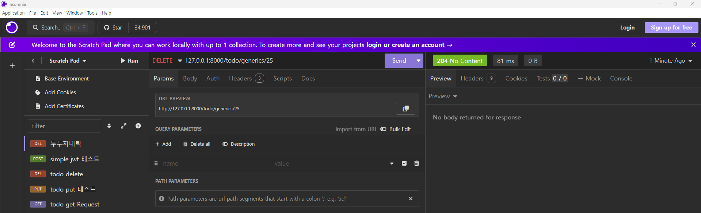

#### 참고 사이트

https://www.youtube.com/watch?v=nbCpf0G_sUk&list=PLniSC_akcqlNwLEEO1FPR_yRu__1husfg&index=8
https://github.com/updaun/django_course

https://velog.io/@mynghn/%EC%A0%9C%EB%84%A4%EB%A6%AD-%EB%B7%B0%EB%A5%BC-%EC%9D%B4%EC%9A%A9%ED%95%B4-API-%EA%B5%AC%EC%B6%95%ED%95%98%EA%B8%B0

#### 1. selializers.py 생성

#### 2. views.py 생성

class TodoGenericsListAPI(generics.ListAPIView):
queryset = Todo.objects.all()
serializer_class = TodoSerializer

위의 코드가 돌아가는 원리는 아래를 참고

https://velog.io/@mynghn/%EC%A0%9C%EB%84%A4%EB%A6%AD-%EB%B7%B0%EB%A5%BC-%EC%9D%B4%EC%9A%A9%ED%95%B4-API-%EA%B5%AC%EC%B6%95%ED%95%98%EA%B8%B0

##### python manage.py startapp todo

##### python manage.py makemigrations

##### python manage.py migrate

##### python manage.py runserver
