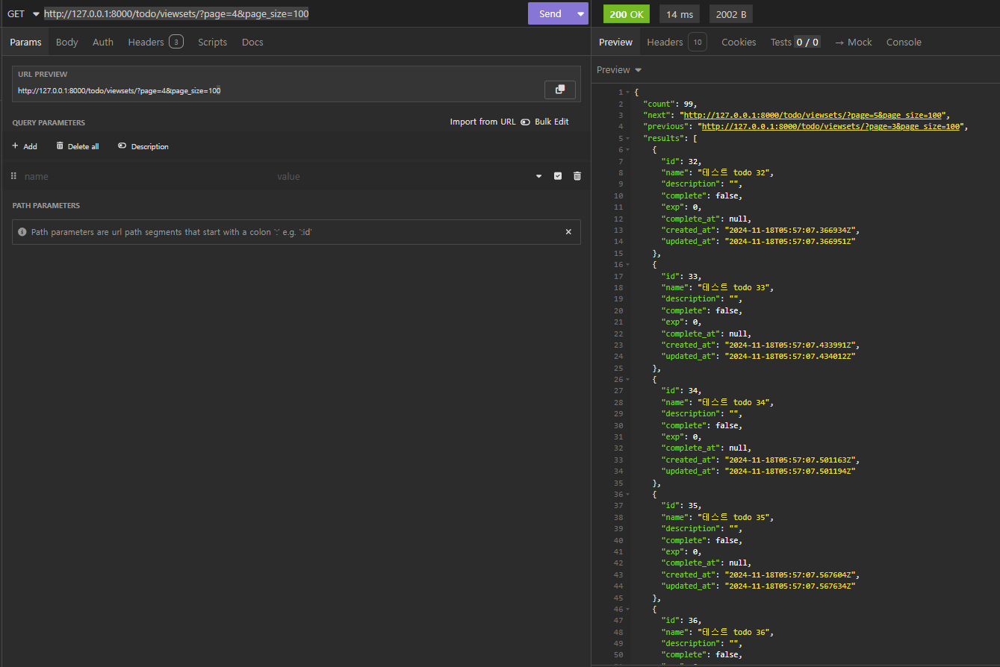

#### 참고 사이트

https://www.youtube.com/watch?v=CDwMxiYoeL0&list=PLniSC_akcqlNwLEEO1FPR_yRu__1husfg&index=17

https://wikidocs.net/197566

https://github.com/updaun/django_course

#### 1. config/setting.py 에 아래의 문구 지정

REST_FRAMEWORK = {
'DEFAULT_PAGINATION_CLASS': 'rest_framework.pagination.PageNumberPagination',
'PAGE_SIZE': 10,
}

#### 2. PageNumberPagination 소스 코드 확인후

아래의 주소로 확인
http://127.0.0.1:8000/todo/viewsets/?page=4&page_size=100

class PageNumberPagination(BasePagination):
"""
A simple page number based style that supports page numbers as
query parameters. For example:

    http://api.example.org/accounts/?page=4
    http://api.example.org/accounts/?page=4&page_size=100
    """

##### python manage.py startapp todo

##### python manage.py makemigrations

##### python manage.py migrate

##### python manage.py runserver
