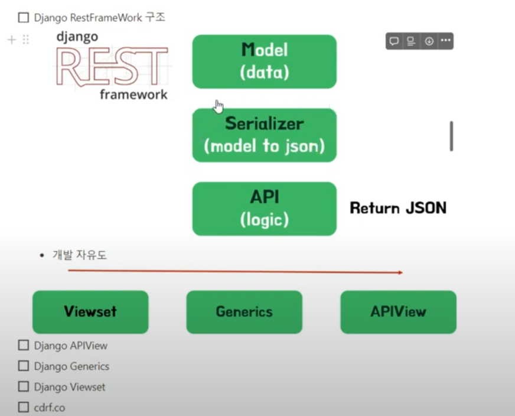

#### 참고 사이트

https://www.youtube.com/watch?v=nbCpf0G_sUk&list=PLniSC_akcqlNwLEEO1FPR_yRu__1husfg&index=8
https://github.com/updaun/django_course

#### 1.todo/management/commands 폴더 만들기

todo/management/commands 폴더 만들기

maketodo.py 파일을 만드후 아래의 명령어

python manage.py maketodo

#### 3. 아래의 명령어 실행후 /admin 으로 확인

##### python manage.py startapp todo

##### python manage.py makemigrations

##### python manage.py migrate

##### python manage.py runserver
