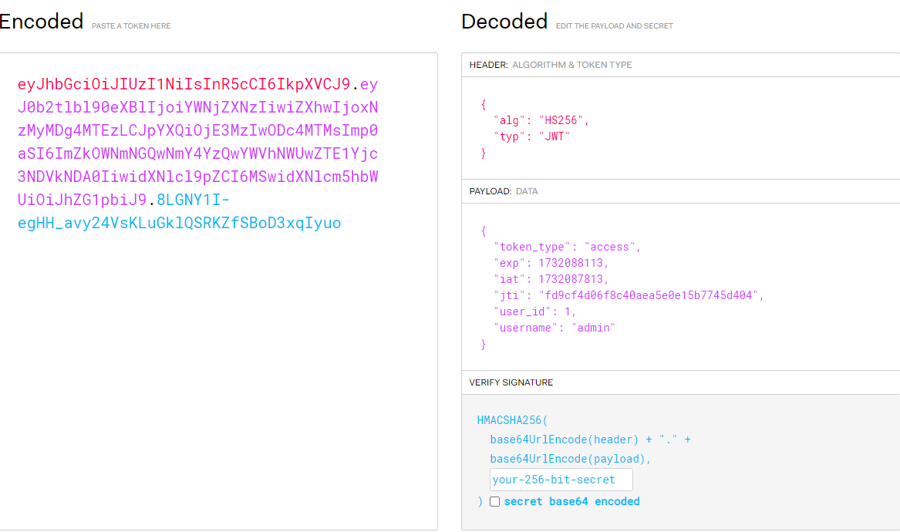
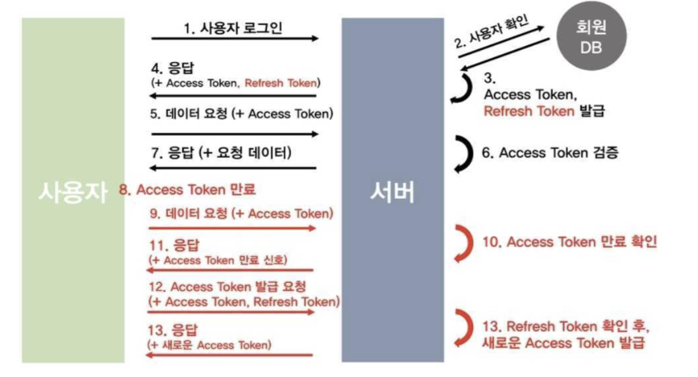

#### 참고 사이트

https://www.youtube.com/watch?v=Qauo-TaumkQ&list=PLniSC_akcqlNwLEEO1FPR_yRu__1husfg&index=31

https://github.com/updaun/django_course/tree/jyt2

#### 1. user/users.py아래의 코드를 추가

https://django-rest-framework-simplejwt.readthedocs.io/en/latest/customizing_token_claims.html

```

class MyTokenObtainPairSerializer(TokenObtainPairSerializer):
    @classmethod
    def get_token(cls, user):
        token = super().get_token(user)

        # Add custom claims
        token['name'] = user.name
        # ...

        return token
```

위의 사이트를 참고

user/urls.py에 아래의 두줄 추가

```
from rest_framework_simplejwt.views import (
    TokenRefreshView,
)


urlpatterns = [
    path('token/', MyTokenObtainPairView.as_view(), name='token_obtain_pair'),
    path('token/refresh/', TokenRefreshView.as_view(), name='token_refresh'),
]
```

#### 2. 아래 주소로 접속후 로그인후 토큰 번호확인

http://127.0.0.1:8000/user/token/
접근후

access 토큰을 받은후 paload 에 username 이 들어오는걸 확인


#### 3. access token 번호를 카피 한후 아래의 사이트로 접속후 access 토큰을 넣은후 해석 되는거 확인


#### 4.아래 사이트 접속후

http://127.0.0.1:8000/token/refresh/

refresh token 을 넣은후 access 토큰이 갱신 되는걸 확인

#### (옵션)5. simple-jwt에 블랙리스트라는 기능이 있어서 사용

https://soupnn.tistory.com/144

# Django project settings.py

...

INSTALLED_APPS = (
...
'rest_framework_simplejwt.token_blacklist',
...
)

아래와 같이 설정
SIMPLE_JWT = {
...
'ROTATE_REFRESH_TOKENS': True,
'BLACKLIST_AFTER_ROTATION': True,
...
}

##### 6. DB를 다시 마이그레이션

python manage.py makemigrations
python manage.py migrate

##### 7. 리프레시 토큰을 입력후 아래와 같이 admin 페이지에서 블랙리스트 추가


##### python manage.py startapp todo

##### python manage.py makemigrations

##### python manage.py migrate

##### python manage.py runserver

##### python manage.py createsuperuser

#### 토큰 전체 흐름도


